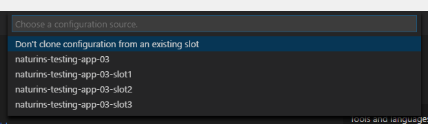
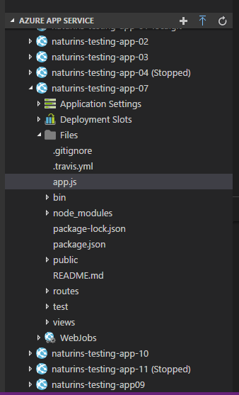

# Azure App Services for Visual Studio Code (Preview)
The Azure App Services extension for VS Code lets you quickly browse, create, manage, and deploy Azure App Service websites.

## Features

  * Browse sites across all of your Azure subscriptions
  * Browse to the Azure Portal for advanced tasks, such as scaling
  * Create new web apps/deployment slots (Linux with Node.js only)
  * Deploy to your web apps/deployment slots
  * View and edit remote files on your web apps (Preview)
  

  * Start, stop, and restart the web app/deployment slot
  * Swap deployment slots
  
  

  * View and edit web app settings
  
  
  * View web app log stream

  

## Preview Features

* View and edit a web app's files
  * To enable this feature, modify your `appService.showRemoteFiles` user setting to true.
  * To modify user settings, click File > Preferences > Settings.

  

  * To view a file, click on it in the explorer.
  

  * To edit, make edits in the editor and save it.  When prompted to upload the file, click "Upload".
  * CAUTION: Manually editing your Web App's files could cause unexpected behavior.

## Known Issues

* Local Git deployment may fail with large commits

## Requirements

All you need is an Azure Subscription to get started. If you don't have one, [click here](https://azure.microsoft.com/en-us/free/) for a free subscription with $200 in Azure credits!

## Contributing

This project welcomes contributions and suggestions.  Most contributions require you to agree to a
Contributor License Agreement (CLA) declaring that you have the right to, and actually do, grant us
the rights to use your contribution. For details, visit https://cla.microsoft.com.

When you submit a pull request, a CLA-bot will automatically determine whether you need to provide
a CLA and decorate the PR appropriately (e.g., label, comment). Simply follow the instructions
provided by the bot. You will only need to do this once across all repos using our CLA.

This project has adopted the [Microsoft Open Source Code of Conduct](https://opensource.microsoft.com/codeofconduct/).
For more information see the [Code of Conduct FAQ](https://opensource.microsoft.com/codeofconduct/faq/) or
contact [opencode@microsoft.com](mailto:opencode@microsoft.com) with any additional questions or comments.

## Telemetry
VS Code collects usage data and sends it to Microsoft to help improve our products and services. Read our [privacy statement](https://go.microsoft.com/fwlink/?LinkID=528096&clcid=0x409) to learn more. If you don’t wish to send usage data to Microsoft, you can set the `telemetry.enableTelemetry` setting to `false`. Learn more in our [FAQ](https://code.visualstudio.com/docs/supporting/faq#_how-to-disable-telemetry-reporting).

## License
[MIT](LICENSE.md)
