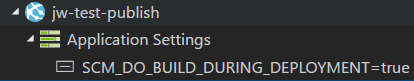
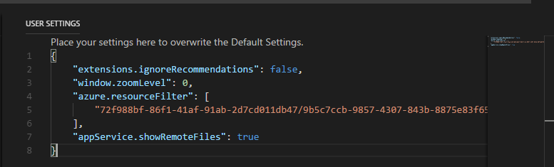
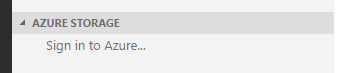
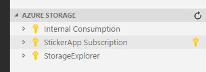

# Azure App Services for Visual Studio Code (Preview)

 

The Azure App Services extension for VS Code lets you quickly browse, create, manage, and deploy Azure App Service websites.

Check out this [deployment tutorial](https://code.visualstudio.com/tutorials/app-service-extension/getting-started) to get started with deploying to Azure App Service on Linux.

## Features

* Browse sites across all of your Azure subscriptions
* Browse to the Azure Portal for advanced tasks, such as scaling
* Create new web apps/deployment slots (Linux with Node.js only)
* Deploy to your web apps/deployment slots

* Start, stop, and restart the web app/deployment slot
* Swap deployment slots
* View and edit web app settings
* View web app log stream

## Configuring Zipdeploy

* How to configure zip deployment:
  * If you set the deployment source of your web app to “None” (the default source on app creation), the deploy command will Zip the contents of a selected folder and upload the Zip file to Azure.

  * VS Code will prompt on deploy if you would like to configure your project for faster deployment.  If you click 'Yes', the following changes will be made in your project:
    * The vscode setting `appService.zipIgnorePattern` is changed to indicate that build artifacts will not be zipped and deployed.  These will be built on the server by running the appropriate build command.
    * A '.deployment' file will be created in the root of the project.  This file configures `SCM_DO_BUILD_DURING_DEPLOYMENT=true` enabling build on deploy.
      > NOTE: Currently only 'node' runtimes support this feature.
  * If you select 'Never show again,' the `appService.showBuildDuringDeployPrompt` vscode setting will be set to `false` and you will no longer be prompted for this project.  Delete this setting or set it to `true` to re-enable the prompt.

  ### Zipdeploy Configuration Settings

  * `appService.zipGlobPattern`
    * Uses a glob pattern to define which files to be included in the deployment. The default value is '**/*'.

  * `appService.zipIgnorePattern`
    * Uses a glob pattern to define which files to be excluded from the deployment. The default value is [] which doesn’t exclude any files/folders.

  * For example, you might want to exclude the 'node_modules' folder from the deployment to speed up the Zip file creation and uploading. In this case, you will need the following setting:
    * `"appService.zipIgnorePattern: ['node_modules{,/**}']"`
  * And in order to have the web app run the proper deployment command to install the npm packages, you need to have the following Application Setting on your site or in a '.deployment' file at the root of your repo:
    * `SCM_DO_BUILD_DURING_DEPLOYMENT=true`

    

## Preview Features

* View and edit a web app's files
  * To enable this feature, click File > Preferences > Settings. modify your `appService.showRemoteFiles` to be true.

  

  * To view a file, click on it in the explorer.
  * To edit, make edits in the editor and save it.  When prompted to upload the file, click 'Upload'.
  * CAUTION: Manually editing your Web App's files could cause unexpected behavior.

## Managing Azure Subscriptions

If you are not signed in to Azure, you will see a "Sign in to Azure..." link. Alternatively, you can select "View->Command Palette" in the VS Code menu, and search for "Azure: Sign In".

If you don't have an Azure Account, you can sign up for one today for free and receive $200 in credits by selecting "View->Command Palette" and searching for "Azure: Create an Account".

You may sign out of Azure by selecting "View->Command Palette" and searching for "Azure: Sign Out".

To select which subscriptions show up in the extension's explorer, click on the "Select Subscriptions..." button on any subscription node (indicated by a "key" icon when you hover over it), or select "View->Command Palette" and search for "Azure: Select Subscriptions". Note that this selection affects all VS Code extensions that support the [Azure Account and Sign-In](https://github.com/Microsoft/vscode-azure-account) extension.

## Known Issues

* Local Git deployment may fail with large commits

## Requirements

All you need is an Azure Subscription to get started. If you don't have one, [click here](https://azure.microsoft.com/en-us/free/) for a free subscription with $200 in Azure credits!

## Contributing

This project welcomes contributions and suggestions.  Most contributions require you to agree to a
Contributor License Agreement (CLA) declaring that you have the right to, and actually do, grant us
the rights to use your contribution. For details, visit https://cla.microsoft.com.

When you submit a pull request, a CLA-bot will automatically determine whether you need to provide
a CLA and decorate the PR appropriately (e.g., label, comment). Simply follow the instructions
provided by the bot. You will only need to do this once across all repos using our CLA.

This project has adopted the [Microsoft Open Source Code of Conduct](https://opensource.microsoft.com/codeofconduct/).
For more information see the [Code of Conduct FAQ](https://opensource.microsoft.com/codeofconduct/faq/) or
contact [opencode@microsoft.com](mailto:opencode@microsoft.com) with any additional questions or comments.

## Telemetry
VS Code collects usage data and sends it to Microsoft to help improve our products and services. Read our [privacy statement](https://go.microsoft.com/fwlink/?LinkID=528096&clcid=0x409) to learn more. If you don’t wish to send usage data to Microsoft, you can set the `telemetry.enableTelemetry` setting to `false`. Learn more in our [FAQ](https://code.visualstudio.com/docs/supporting/faq#_how-to-disable-telemetry-reporting).

## License
[MIT](LICENSE.md)
