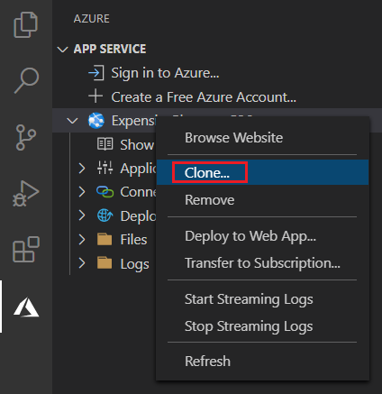
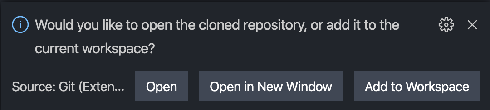
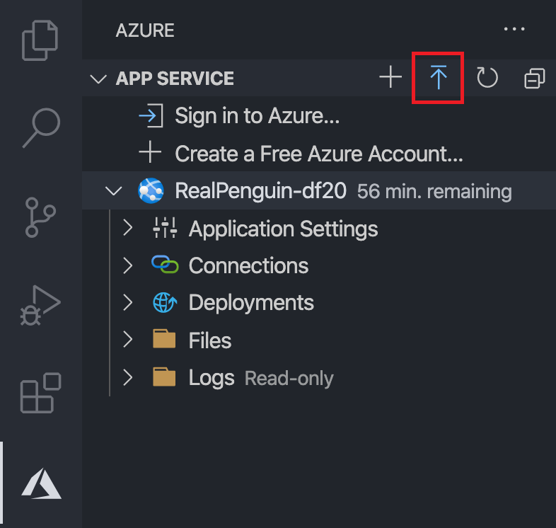
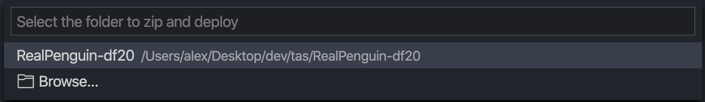
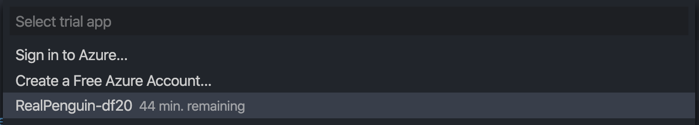
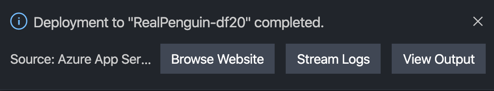
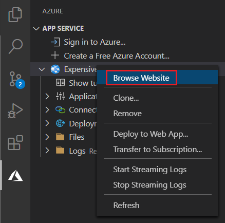

# Welcome to your Trial App Didact Tutorial

This tutorial will show you how to make and deploy changes to your Azure App Service trial app. Your trial will last 60 minutes. You can find more information about Azure App Service [here](https://docs.microsoft.com/en-us/azure/app-service/).

## Getting Started

### Step 1: Clone the trial app source code

1. Locate your imported trial app in the Azure view.

2. Right-click on the trial app.
3. Select `Clone`.

4. Select the cloned repository's location.
5. When the repository has finished cloning a notification like the one below will appear. Open the folder in VS Code or add it to the workspace.

### Step 2: Make some changes to your app

Make some changes to your trial app. Try changing some text in `template.html`.

For example, change line 26 from: `<h1> Welcome to Azure! </h1>` to this: `<h1> Hello, world! </h1>`

[Click here](didact://?commandId=workbench.view.explorer) to view the project files in the Explorer.

### Step 3: Deploy your changes

1. Select the blue up arrow icon to deploy your code to your trial app.

2. Select the folder containing the trial app code you cloned and modified.

3. Select your trial app.

4. You will see the following notification once your deployment is complete. You can click `Browse` to view the changes live.

You can also browse your website by right-clicking your trial app and selecting `Browse`.

### Step 4: Transfer your trial app to an Azure Subscription

Transferring your App to an Azure Subscription will create a new Web App and automatically deploy the trial app from your local workspace.

[Click here](didact://?commandId=appService.TransferToSubscription) or follow the steps below to Transfer your trial app to an Azure Subscription.

1. Right-click your trial app, then select `Transfer to Subscription...`

2. Sign-in or Create an Azure account

3. Enter a name for your new Web App

Once your Web App is created, your trial app will automatically be deployed.

---

This tutorial is made with [vscode-didact](https://github.com/redhat-developer/vscode-didact).
